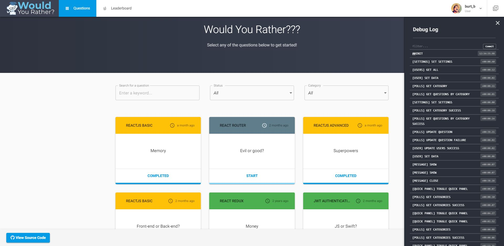
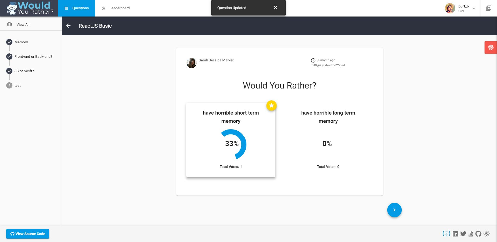
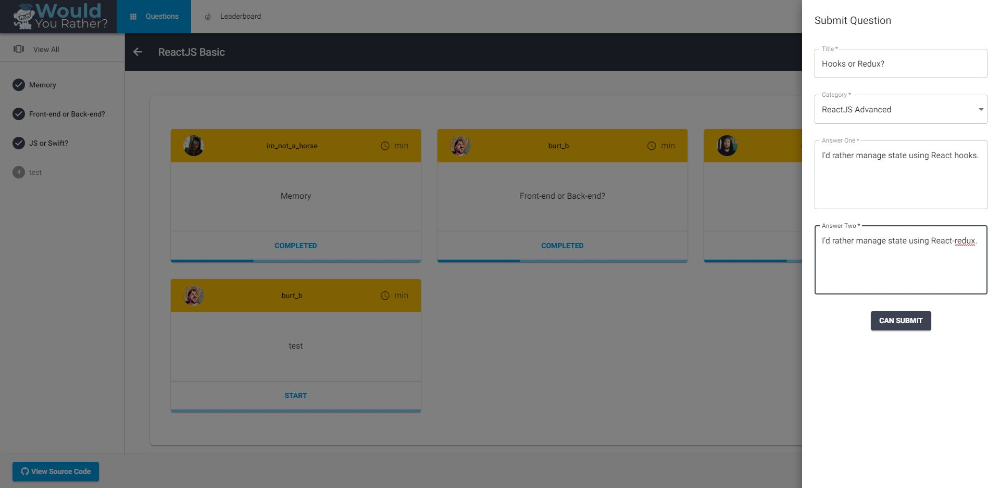
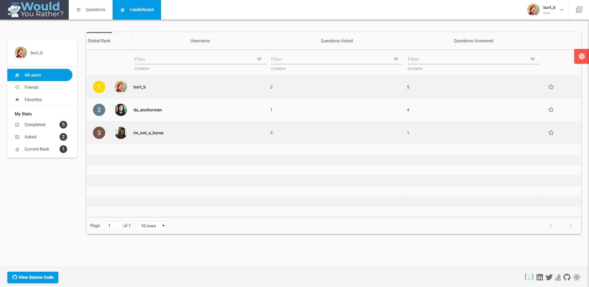
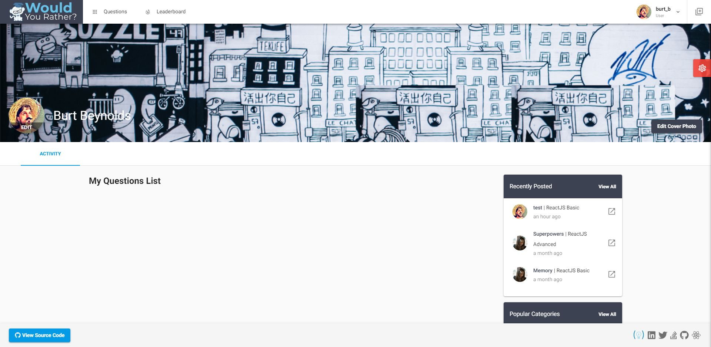

# Would You Rather Project
*Project & Docs are a work in progress*
*Demo:*  https://eddielee394.github.io/react-wyr

## Overview
A prematurely optimized, over-engineered & unnecessarily complicated "Would You Rather" game built with ReactJS, Redux & a bunch of other stuff I probably didn't need to use - (WIP)

### But... Why???
The purpose behind this monstrosity is to demonstrate some real-world complexities and pitfalls that we tend to encounter when working on actual projects.  Often times we as developers (or maybe it's just me...) have a tendency to overcomplicate, overengineer or prematurely optimize even the simplest of applications.  This is an excellent representation of this very human behavior.

**Warning** The following has been attempted by a professional developer (even though said developer may wear pajamas to work every day). Please don't try this at home - or actually... yeah, go ahead & try it.  Break stuff and learn a few new things in the process.  That's what makes being a developer fun.

### Some packages being used
- React 16
- Redux 4
- Redux thunk
- Redux Logger
- Redux Devtools
- React-fontawesome 5
- Material-ui 3.x
- Tailwind css (Grid) 4.x
- Axios
- Axios-mock-adapter
- Formsy-react
- Jwt
- Local Forage
- React Router
- React Spinners
- React swipeable views
- react table
- Velocity-react

## Getting Started
- Clone repo
- Run `npm install`
- Run `npm start`
- Navigate to `http://localhost:3000` in your browser to view site
- If you're feelin froggy, setup a reverse proxy on your virtual host and experience the site as if you were surfing on the actual web (who needs port addresses anyway???).

## Feature List:
- JWT Authorization
- User registration
- State persistence using custom Local Forage integration (Getting redux-persist to work properly proved to be a lil difficult)
- Authorized routing
- Custom templating system (thanks to the guys at @Fuse for the inspiration)
- Axios & Axios mock adapter integration for simulated serverside requests
- Users can:
  - Select avatars
  - Select profile cover photos
  - post questions
  - register new accounts and persist account data across browser sessions
- API middleware integration

## Roadmap: 
- Allow users to follow other users
- Redux-persist integration (I'll get it right eventually)
- Portable backend api
- Integration redux-orm
- UI updates
- Question feed on user profiles

## Todo List:
- [x] Start writing todo list
- [x] Write feature list
- [x] Write Roadmap
- [x] fix issue where category state persists on `/questions` page  when navigating back from empty `QuestionsList` component path, causing an undefined category error in the CategoryList component.
- [ ] fix issue where authenticated users are temporarily redirected to login page when browser is refreshed.
