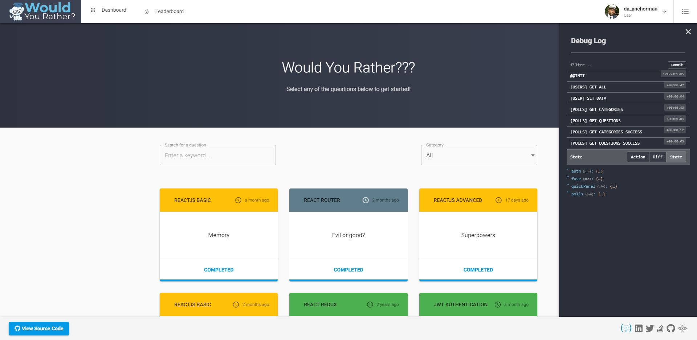

# Would You Rather Project
*Project & Docs are a work in progress*

**Some packages being used:** 
- React 16
- Redux 4
- React-fontawesome 5
- Material-ui 3.x
- Bootstrap (Grid) 4.x
- Axios
- Axios-mock-adapter
- Formsy-react
- Jwt
- Normalizr 3.x,
- Velocity-react

## Getting Started
- Clone repo
- Run `npm install`
- Run `npm start`
- Navigate to `http://react-wyr.local:3000` in your browser to view site

## Feature List:
... 

## Roadmap: 
...

## Todo List:
- [x] Start writing todo list
- [ ] Write feature list
- [ ] Write Roadmap
- [ ] fix issue where category state persists on `/questions` page  when navigating back from empty `QuestionsList` component path, causing an undefined category error in the CategoryList component.
